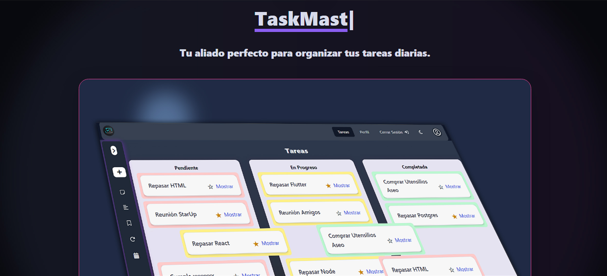
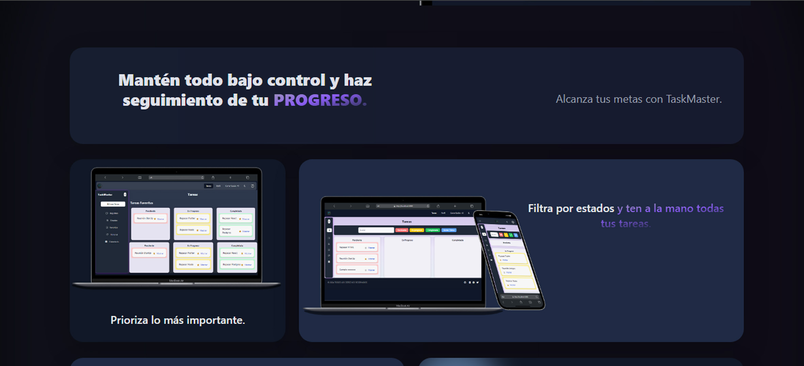
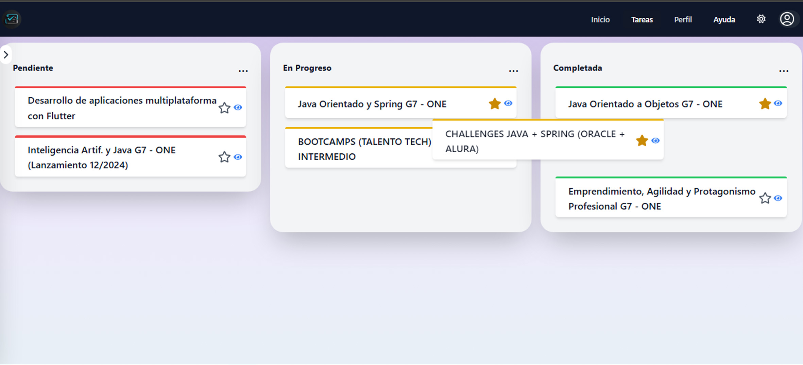
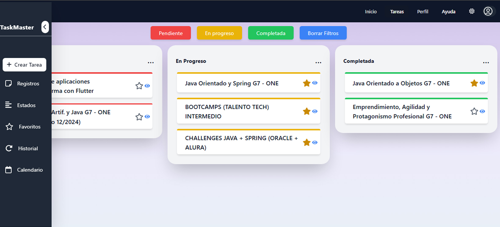
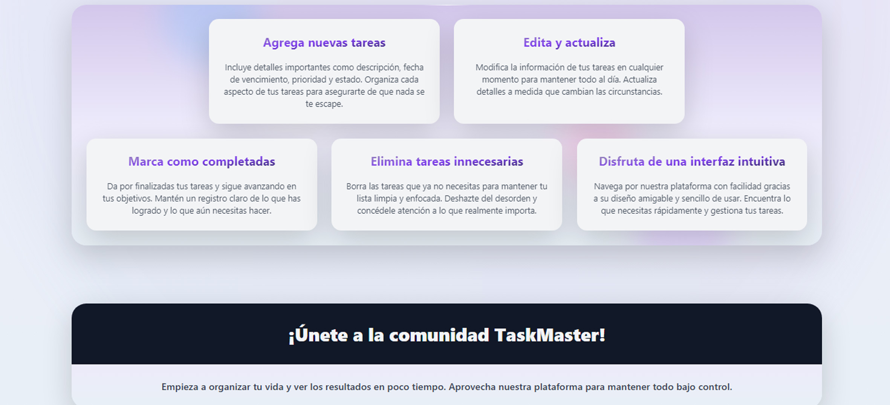

# TaskMaster - Frontend

Este es el repositorio del frontend para la aplicación **TaskMaster**, una herramienta de gestión de tareas que permite crear, editar, eliminar y mover tareas entre diferentes estados. Además, permite almacenar tareas en el historial, gestionar detalles y visualizarlas en un calendario.

## Características

- Autenticación de usuarios.
- Gestión de tareas con diferentes estados (pendiente, en progreso, completada).
- Funcionalidad de drag-and-drop para cambiar el estado de las tareas.
- Historial de tareas completadas y eliminadas.
- Modal para ver y gestionar los detalles de las tareas.
- Visualización de tareas en un calendario según la fecha de creación.
- Soporte para modo claro y oscuro.

## Tecnologías utilizadas

- **React**: Biblioteca para la creación de interfaces de usuario.
- **Tailwind CSS**: Framework CSS para el diseño responsivo y personalización de estilos.
- **React Calendar**: Librería para mostrar tareas en un calendario.
- **Hello Pangea DnD**: Librería para implementar drag-and-drop.
- **Supabase**: Autenticación con OAuth para iniciar sesión con Google.
- **Fetch API**: Para las llamadas al backend.

## Scripts Disponibles

## Vista para la funcionalidad de la web

## Vista para las características

## Contribuciones

Las contribuciones son bienvenidas.

## Visitar sitio web 

https://t4sk-master.netlify.app/start
